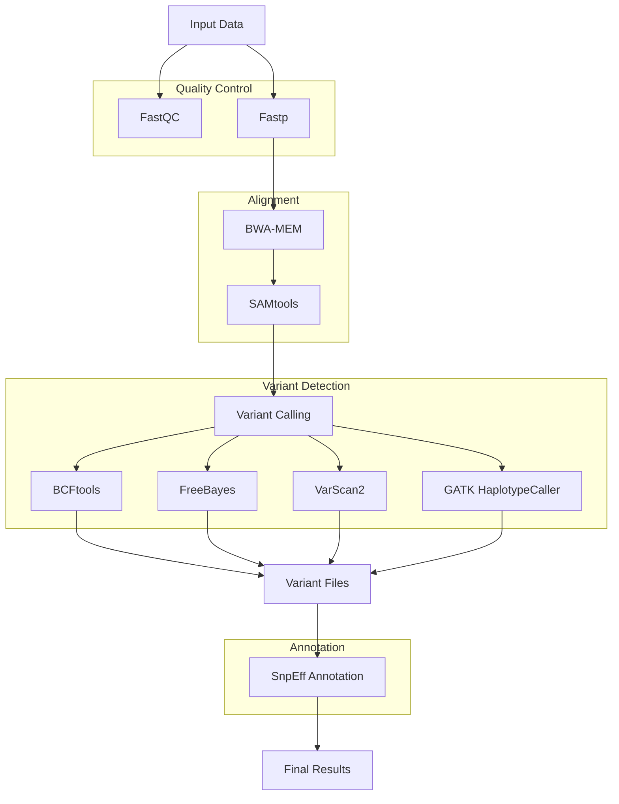

# Bacterial Mutation Pipeline

A Nextflow pipeline for detecting mutations in bacterial populations using paired-end short read sequencing data.

## Overview

This pipeline processes multiple bacterial samples to identify mutations using a reference genome and paired-end sequencing data. It performs quality control, preprocessing, alignment, variant calling using multiple callers, and annotation using containerized bioinformatics tools.

## Project Structure

```
bacterial-mutation-pipeline
├── main.nf                # Main Nextflow pipeline script
├── nextflow.config         # Configuration settings for the pipeline
├── modules                 # Contains individual modules for processing
│   ├── fastqc.nf          # FastQC module for quality assessment of reads
│   ├── bwa.nf             # BWA module for aligning reads to the reference genome
│   ├── samtools.nf        # SAMtools module for processing alignment files
│   ├── bcftools.nf        # BCFtools module for variant calling
│   └── snpeff.nf          # SnpEff module for variant annotation
├── bin                     # Directory for custom scripts
│   └── custom_scripts      # Custom scripts for specific tasks
├── conf                    # Configuration files
│   └── base.config         # Base configuration parameters
└── README.md               # Documentation for the project
```

## Pipeline Components

| Module | Container | Function |
|--------|-----------|-----------|
| FastQC | `quay.io/biocontainers/fastqc:0.12.1` | Quality control of sequencing reads |
| BWA | `quay.io/biocontainers/bwa:0.7.17` | Read alignment to reference genome |
| SAMtools | `quay.io/biocontainers/samtools:1.18` | BAM file processing |
| BCFtools | `quay.io/biocontainers/bcftools:1.18` | Variant calling |
| SnpEff | `quay.io/biocontainers/snpeff:5.1` | Variant annotation |

## Prerequisites

- Nextflow (>=21.04.0)
- Singularity
- Input data:
  - Reference genome (FASTA format)
  - Sample information (CSV format)
  - Paired-end reads (FASTQ format)

## Input Format

Create a CSV file with your sample information:
```csv
sample,fastq_1,fastq_2
sample1,/path/to/sample1_R1.fastq.gz,/path/to/sample1_R2.fastq.gz
sample2,/path/to/sample2_R1.fastq.gz,/path/to/sample2_R2.fastq.gz
```

## Usage

Basic usage:
```bash
nextflow run main.nf --input samples.csv --genome reference.fasta
```

Parameters:
- `--input`: Path to sample sheet (CSV format)
- `--genome`: Path to reference genome (FASTA format)
- `--outdir`: Output directory (default: 'results')

## Output Structure

```
results/
├── sample1/
│   ├── fastqc/
│   ├── alignment/
│   ├── bam/
│   ├── variants/
│   └── annotated/
└── sample2/
    ├── fastqc/
    ├── alignment/
    ├── bam/
    ├── variants/
    └── annotated/
```

## Workflow Diagram


## Resource Requirements

| Module | CPUs | Memory |
|--------|------|---------|
| FastQC | 2 | 4 GB |
| BWA | 4 | 8 GB |
| SAMtools | 4 | 8 GB |
| BCFtools | 2 | 4 GB |
| SnpEff | 2 | 4 GB |

## Container Usage

This pipeline uses Singularity as the default container engine, with containers sourced from Quay.io. Container definitions are handled automatically by the pipeline.

## License

This project is licensed under the MIT License - see the LICENSE file for details.